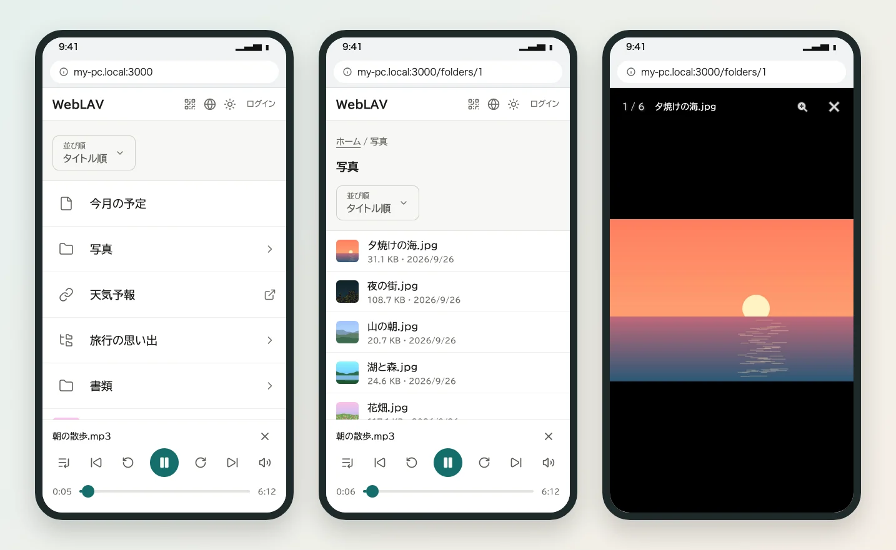
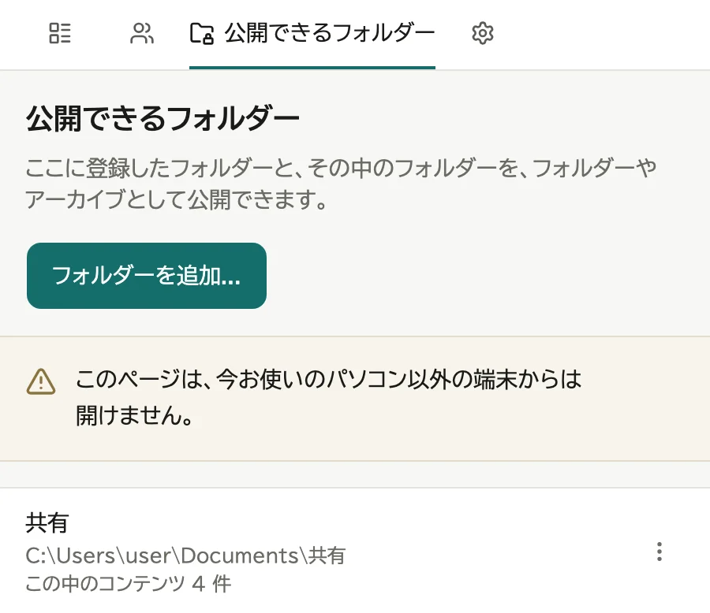

# はじめに

WebLAV は、パソコンの中のファイルを、同じネットワークにいるスマートフォンやタブレットのブラウザーで見られるようにするアプリです。

このマニュアルは、通知領域 (macOS はメニューバー、Ubuntu は画面右上) の WebLAV アイコンの「マニュアル」から、いつでも開けます。

## できること

- 音声を再生する
- 画像・PDF・動画・テキストを見る
- 外部サイトへのリンクを並べる
- 見せる相手を、誰でも・ログインした人だけ・自分だけに分ける

## しくみ

見る人の画面に出るのは、管理画面でコンテンツとして登録したものだけです。

- **公開できるフォルダー**: コンテンツを選べる範囲です。追加しただけでは、見る人の画面には何も出ません。
- **コンテンツ**: 公開できるフォルダーの中から、見せたいフォルダーを「フォルダー」や「アーカイブ」として登録します。見る人の画面に出るのはこれです。

## クイックスタート

1. インストールして起動する。Windows は Microsoft Store で「WebLAV」を入手して開く、macOS は `WebLAV.app` を「アプリケーション」フォルダーに入れて開く

2. 通知領域 (macOS はメニューバー、Ubuntu は画面右上) の WebLAV アイコンから「セットアップ」を選び、管理者を作る。表示されたリカバリコードは保管しておく

   

   

3. 管理画面の「公開できるフォルダー」で、見せてよいフォルダーを追加する。WebLAV を動かしているパソコンで、通知領域のメニューの「ブラウザーで開く」から開いたときだけ出る (→ [公開できるフォルダーを追加する](04-roots.md))

   

4. 「コンテンツ」の「新規追加...」で「フォルダー」を選び、見せたいフォルダーを登録する

   

5. 画面右上の共有のアイコンを押して「QRコードを表示...」を選び、同じ Wi-Fi のスマートフォンで読み取る

   

- 詳しい手順 → [設置する](02-setup.md)
- ほかの種類や公開範囲 → [コンテンツを登録する](05-register-content.md)
- 開けないとき → [うまくいかないとき](11-troubleshooting.md)
