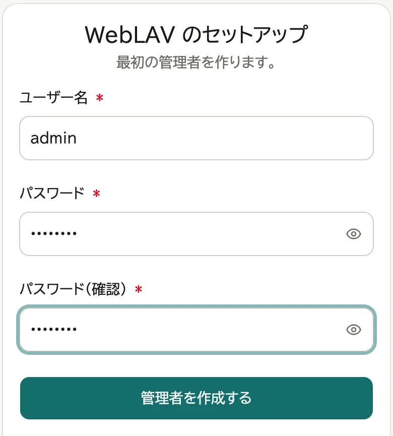
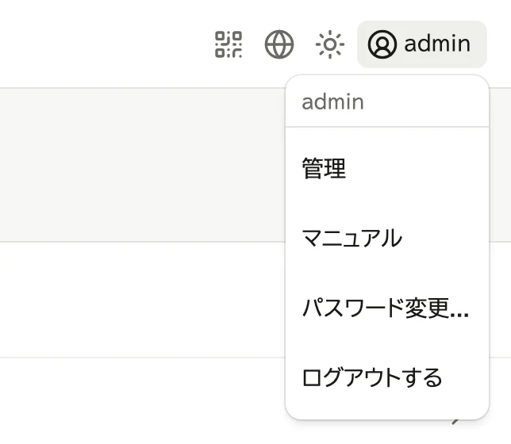

# 設置する

サーバーにするパソコンで、次の順に進めます。

## 1. インストールする

### Windows

1. Microsoft Store で「WebLAV」を検索し、「入手」を押す
2. 入ったら「開く」を押す

一度起動すると、サインインしたときに自動で起動するようになります。
止めるには、通知領域の WebLAV アイコンで「サインイン時に起動」をオフにします。

### macOS

1. `WebLAV.app` を「アプリケーション」フォルダーに入れて開く
2. 「ネットワーク受信接続を許可しますか?」と聞かれたら「許可」を押す

自動で起動するには、メニューバーの WebLAV アイコンで「ログイン時に起動」をオンにします。
「システム設定で許可してください」と出たら、それを押し、「ログイン項目」で WebLAV をオンにします。

### Ubuntu

自動で起動するには、画面右上の WebLAV アイコンで「ログイン時に起動」をオンにします。

## 2. 最初の管理者を作る

1. 通知領域 (macOS はメニューバー、Ubuntu は画面右上) の WebLAV アイコンから「セットアップ」を選ぶ

   

2. 開いたブラウザーで、ユーザー名とパスワードを決めて「管理者を作成する」を押す

   

3. 表示されたリカバリコードを「ファイルに保存」か「印刷」で控え、「保管しました」を押す

リカバリコードは、パスワードを忘れたときに自分で再設定するためのものです (→ [ログインと表示](03-account.md))。
表示されるのはこのときだけなので、ほかの人の目に触れない場所に保管します。
「保管しました」を押すと、管理画面が開きます。

「このリンクは使えません」と出たら、もう一度「セットアップ」を選び直します。

## 3. 管理画面を開く

画面右上のユーザー名を押し、「管理」を選びます。

次は [公開できるフォルダーを追加する](04-roots.md) に進みます。
