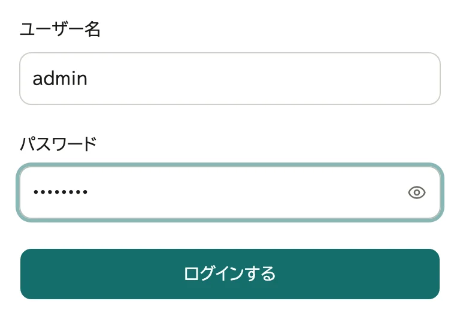
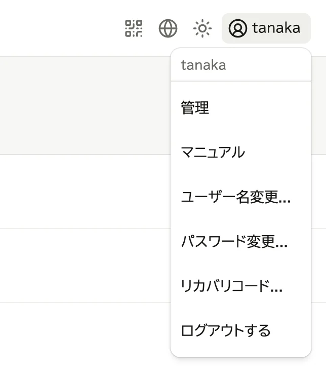
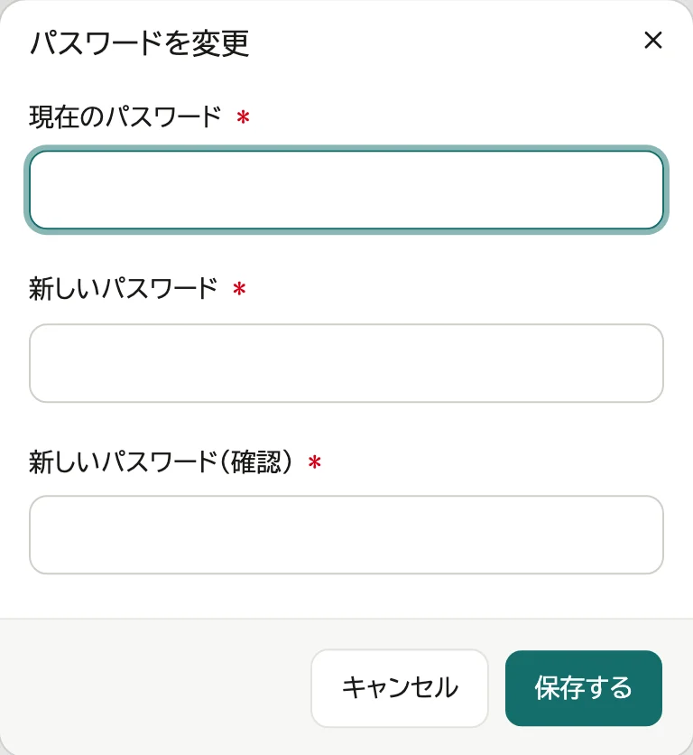
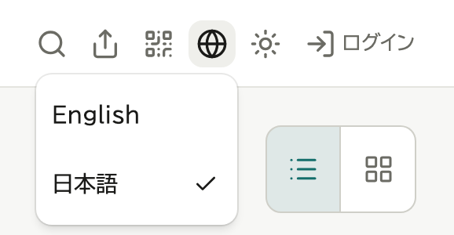
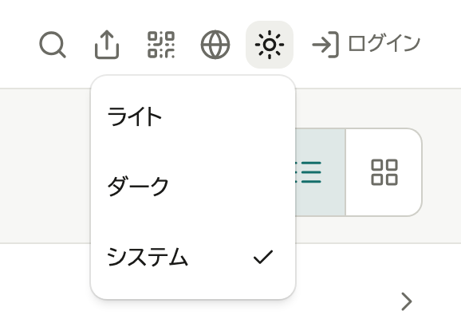

# ログインと表示

## ログインする

ログインした人にだけ見えるものがあります。

1. 画面右上の「ログイン」を押す

   

2. ユーザー名とパスワードを入れ、「ログインする」を押す

   

ログアウトするときは、画面右上のユーザー名を押し、「ログアウトする」を選びます。

## パスワードを変える

1. 画面右上のユーザー名を押し、「パスワード変更...」を選ぶ

   

2. 今のパスワードと新しいパスワードを入れ、「保存する」を押す

   

パスワードを忘れたときは、リカバリコードで自分で再設定するか (→ 下の「パスワードを忘れたとき」)、管理者に再設定を頼みます。

## ユーザー名を変える

1. 画面右上のユーザー名を押し、「ユーザー名変更...」を選ぶ

   

2. 新しいユーザー名と今のパスワードを入れ、「保存する」を押す

次からは新しいユーザー名でログインします。パスワードとリカバリコードはそのまま使えます。控えたリカバリコードに書いてあるユーザー名は古いままなので、パスワードを忘れたときは新しいユーザー名を入れます。

## リカバリコードを作る

リカバリコードがあれば、パスワードを忘れても自分で再設定できます。
失くしたときや、ほかの人に見られたかもしれないときも、ここで作り直します。作り直すと、前のコードは使えなくなります。

1. 画面右上のユーザー名を押し、「リカバリコード...」を選ぶ
2. 今のパスワードを入れ、「作る」を押す
3. 表示されたコードを「ファイルに保存」か「印刷」で控え、「保管しました」を押す

リカバリコードをまだ作っていない管理者には、管理画面の上に「リカバリコードを作る」が出ます。そこからも作れます。

## パスワードを忘れたとき

1. ログインの画面で「パスワードを忘れた」を押す
2. ユーザー名・リカバリコード・新しいパスワードを入れ、「再設定する」を押す
3. 新しいリカバリコードが表示されるので、控えて「保管しました」を押す

使ったリカバリコードは使えなくなり、新しいコードに替わります。
リカバリコードが無いときは、管理者に再設定を頼みます。管理者で、リカバリコードも失くしたときは、[うまくいかないとき](11-troubleshooting.md) の「管理者のパスワードを忘れた」を見てください。

## 表示を変える

- 言語: 画面右上の地球儀のアイコンを押して選ぶ

  

- 明るい・暗い表示: 画面右上の太陽 (暗い表示では月) のアイコンを押して選ぶ。「システム」は端末の設定に合わせる

  
