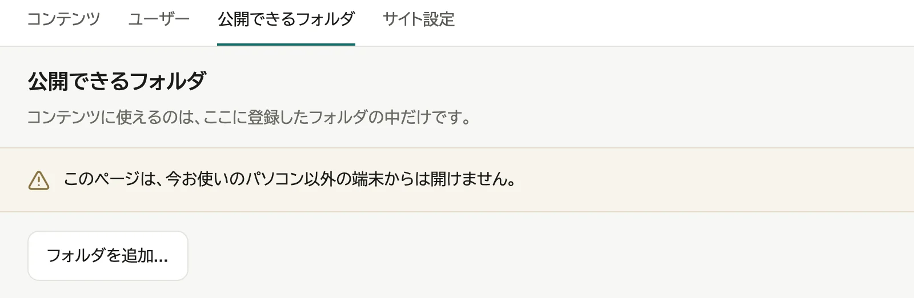
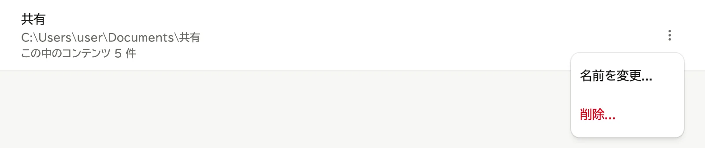
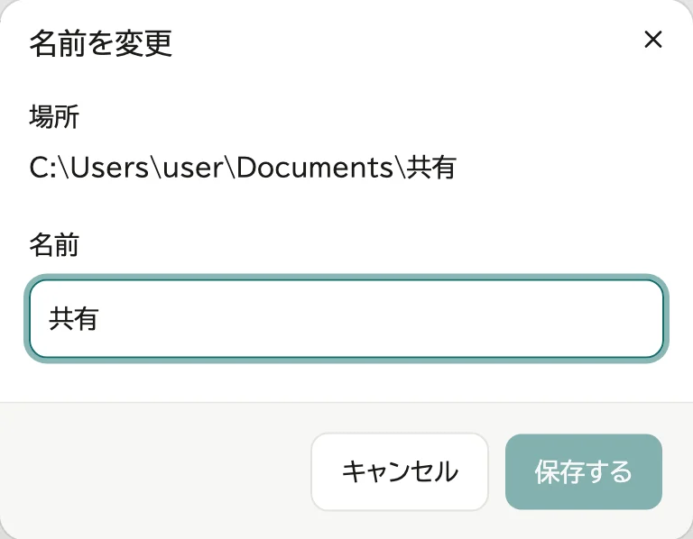
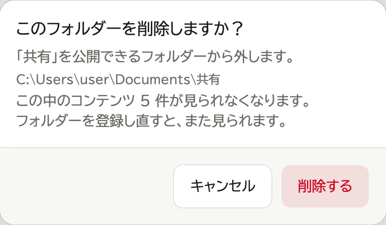

# 公開できるフォルダーを追加する

「公開できるフォルダー」は、コンテンツを選べる範囲です。
**追加しただけでは、見る人の画面には何も出ません。**
この中のフォルダーを、[コンテンツを登録する](05-register-content.md) で「フォルダー」や「アーカイブ」として登録すると出ます。

> **WebLAV を動かしているパソコンで、`localhost` のアドレスで開いたときだけ操作できます。**
>
> - スマートフォンやほかのパソコンから開くと、管理画面に「公開できるフォルダー」が出ません。
> - 同じパソコンでも、QR コードのアドレス (`http://my-pc.local:3000` など) で開くと出ません。

## 開く

1. WebLAV を動かしているパソコンで、通知領域 (macOS はメニューバー、Ubuntu は画面右上) の WebLAV アイコンから「ブラウザーで開く」を選ぶ。開くのは `http://localhost:3000` です

   

2. 管理者でログインし、画面右上のユーザー名を押して「管理」を選ぶ

   

3. 「公開できるフォルダー」のタブを押す

   

## 追加する

1. 「フォルダーを追加...」を押す

   

2. 開いたフォルダーを選ぶ窓で、見せたいフォルダーを選ぶ (Windows では「フォルダーの選択」、macOS では「開く」、Ubuntu では「選択」を押す)

選ぶとすぐに一覧に追加されます。

`C:\` やユーザーのフォルダー全体のような広い場所は追加しないでください。中のファイルをすべて登録できるようになります。

## 名前を変える

名前は、コンテンツを登録するときのフォルダー選びと、コンテンツの場所の表示に、パスの代わりに出ます。

1. 行の「⋮」を押し、「名前を変更...」を選ぶ

   

2. 名前を入れ、「保存する」を押す

   

## 削除する

> **削除しても、パソコンの中のフォルダーとファイルは消えません。**
>
> 消えるのは、WebLAV の「公開できるフォルダー」の一覧にある登録だけです。フォルダーは元の場所にそのまま残ります。

1. フォルダーの行の「⋮」を押し、「削除...」を選ぶ

   

2. 「削除する」を押す

   

中に登録したコンテンツは見られなくなりますが、登録は残ります。同じフォルダーを追加し直せば、また見られます。

次は [コンテンツを登録する](05-register-content.md) に進みます。
