# コンテンツを登録する

## 種類

| 見せたいもの | 種類 |
|---|---|
| パソコンの中のフォルダーを、そのまま | フォルダー |
| 数の多いファイルを、年度や回で絞り込めるように | アーカイブ (→ [アーカイブを設定する](06-archive-setup.md)) |
| ファイルを1つだけ | ファイル (アップロード。既定で 100MB まで) |
| 外部サイト | リンク |
| いくつかをまとめる | グループ |

フォルダーとアーカイブで選べるのは、「公開できるフォルダー」の中だけです (→ [公開できるフォルダーを追加する](04-roots.md))。
見る人の画面に出るのは、ここで登録したものだけです。

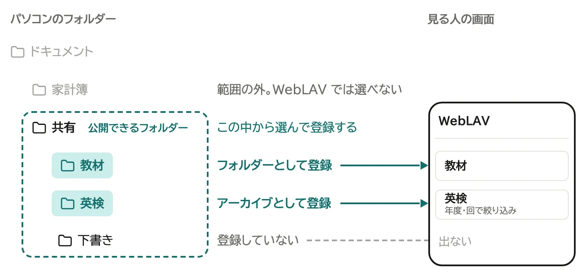
タイトルは自動で付きます。直すときは、登録後に開く編集ページで直します。

## 始める

1. 管理画面の「コンテンツ」のタブで「新規追加...」を押す

   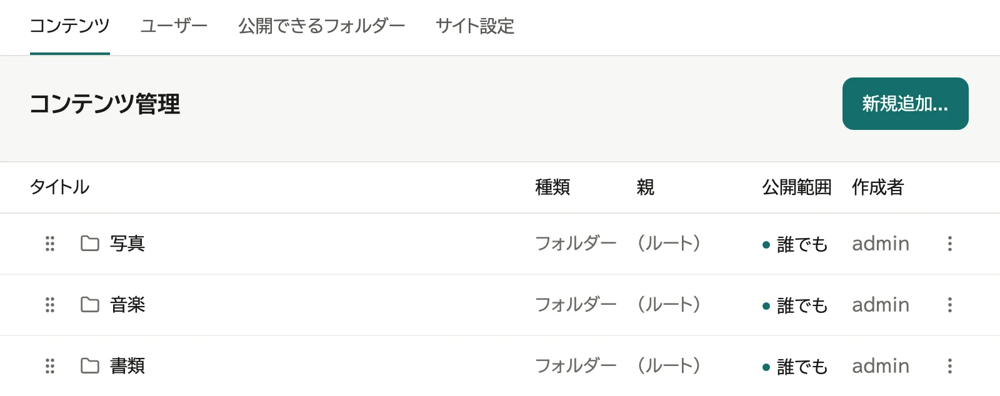

2. 種類を選ぶ

   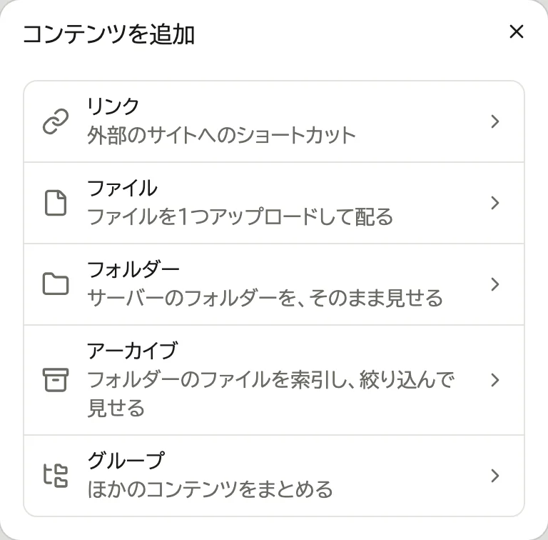

続きは種類ごとに違います。

## フォルダー

1. 「選ぶ...」を押す

   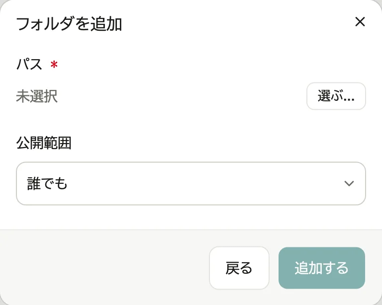

2. 公開できるフォルダーから辿って見せたいフォルダーを開き、「このフォルダーにする」を押す

   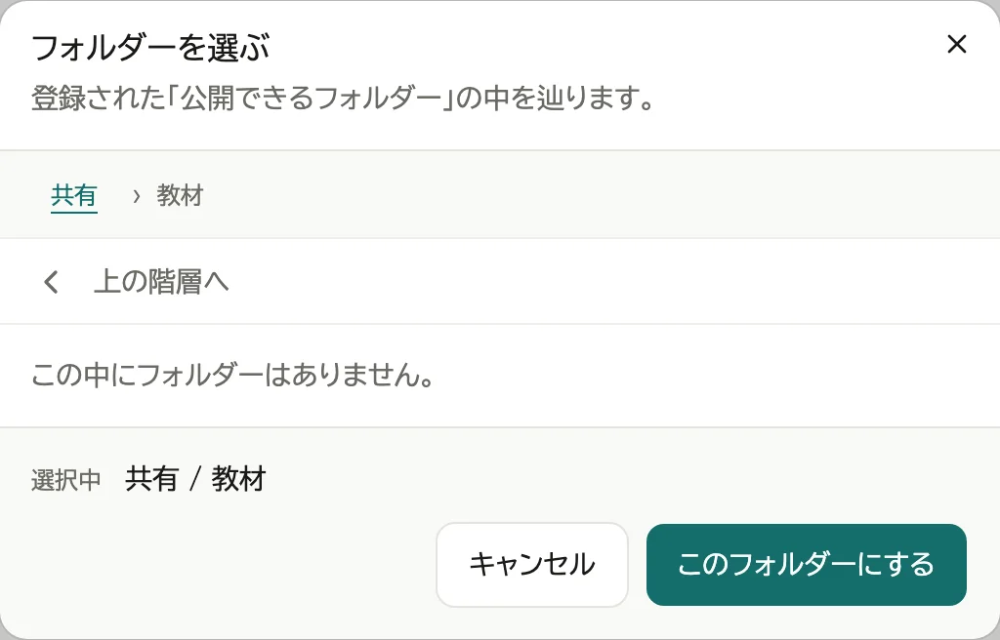

3. 「追加する」を押す

   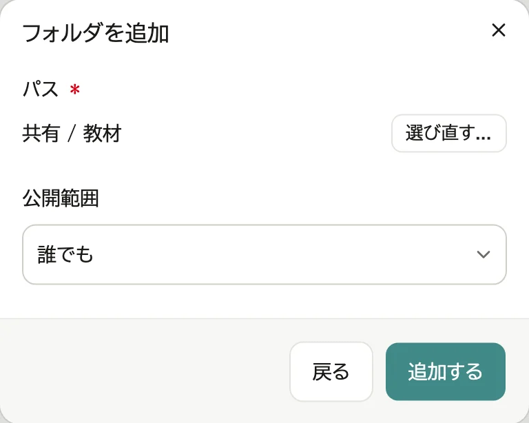

## ファイル

1. 枠を押してファイルを選び (枠へドロップしても構いません)、「追加する」を押す

   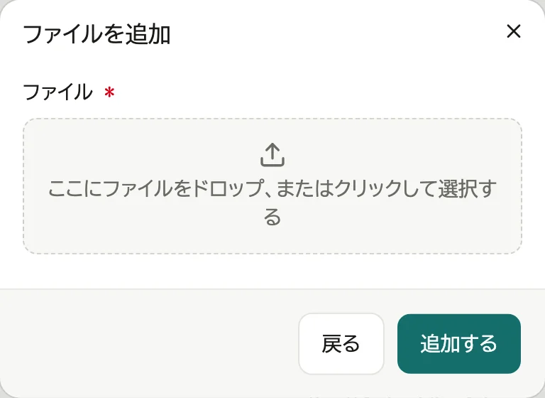

## リンク

1. URL を入れ、「追加する」を押す

   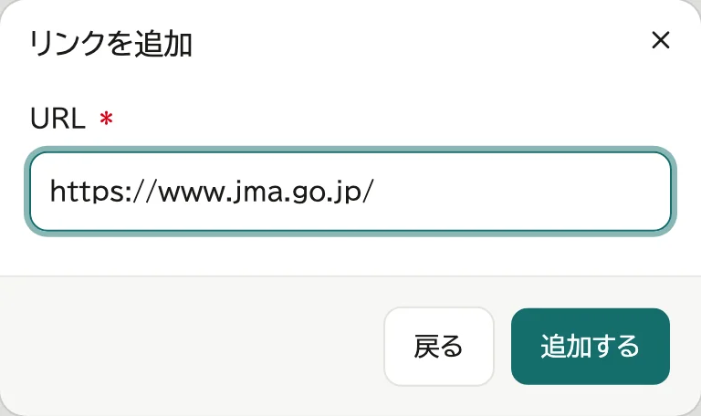

リンクをまとめて見せるときは、名前が `.links.toml` で終わるテキストファイルに書き、フォルダーに置くか、ファイルとして登録します。
開くと、中のリンクが、リンクを登録したときと同じ形で並びます。

```toml
title = "今朝のおすすめ"

[[links]]
url = "https://example.com/"
note = "リンクの下に出す説明 (省いても構いません)"
```

- リンクは `[[links]]` ごとに書きます。並びは書いた順です。
- `title` を省くと、ファイル名が題になります。
- 文字コードは UTF-8 で保存します。読めない書き方のときは、その旨と、ファイルを新しいタブで開くボタンが出ます。

## グループ

1. タイトルを入れ、「追加する」を押す

   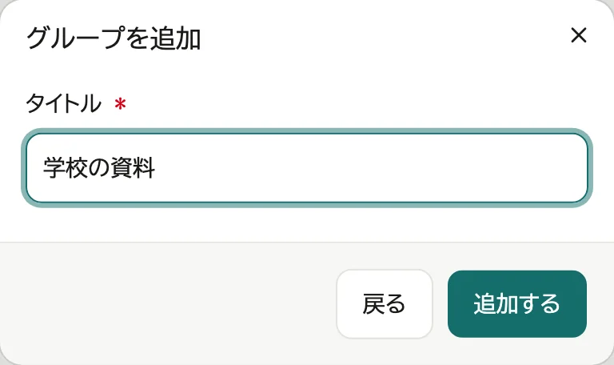

## 公開範囲を変える

| 公開範囲 | 見える人 |
|---|---|
| 誰でも | 全員 (既定) |
| 要ログイン | ログインした人 |
| 本人のみ | 登録した本人 |
| 非表示 | 誰にも見えない (管理画面からは開ける) |

1. 「コンテンツ」の一覧で、行の「⋮」を押し、「編集」を選ぶ

   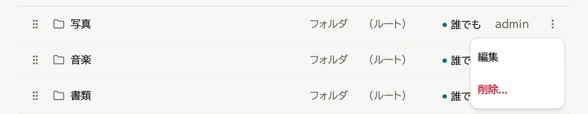

2. 「公開範囲」を選び、「保存する」を押す

   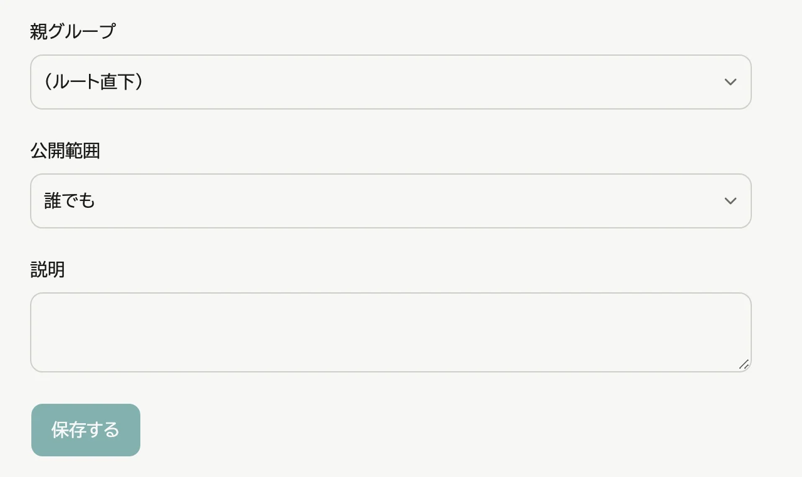

グループの中に入れたものは、グループの公開範囲も満たす人にだけ見えます。

## グループに入れる

新しく入れるとき:

1. グループの行の「⋮」を押し、「この中に追加...」を選ぶ

   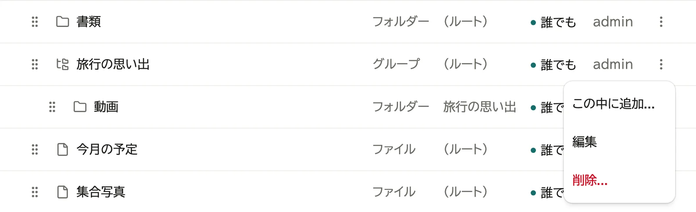

2. あとは「始める」の2から同じ

登録済みのものを移すとき:

1. 行の「⋮」→「編集」で編集ページを開く
2. 「親グループ」を選び、「保存する」を押す

   

## 内容を変える

行の「⋮」→「編集」で編集ページを開き、直して「保存する」を押します。

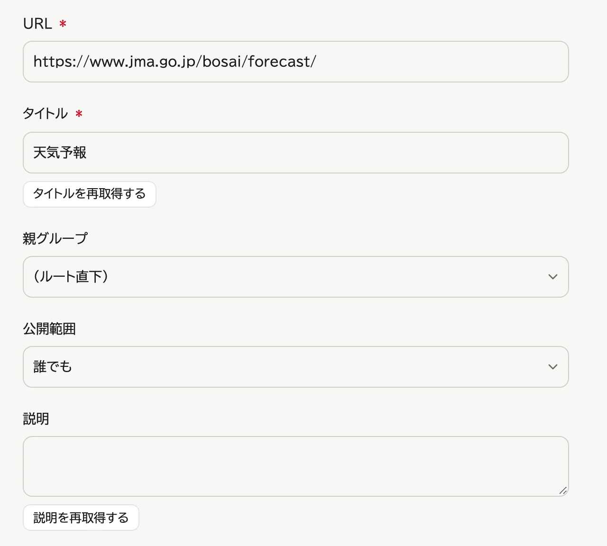

- タイトル・説明
- リンク: 「タイトルを再取得する」「説明を再取得する」で、リンク先から取り直す
- ファイル: 新しいファイルをドロップするか、押して選ぶと差し替わる
- アーカイブ: 「対象の拡張子」(例: `mp3, pdf`) で、載せるファイルを絞る。空ならすべて。
  変えたら、「アイテム」のタブで「再スキャンする」を押す (→ [アーカイブを設定する](06-archive-setup.md))

## 削除する

1. 行の「⋮」を押し、「削除...」を選ぶ

   

2. 「削除する」を押す

   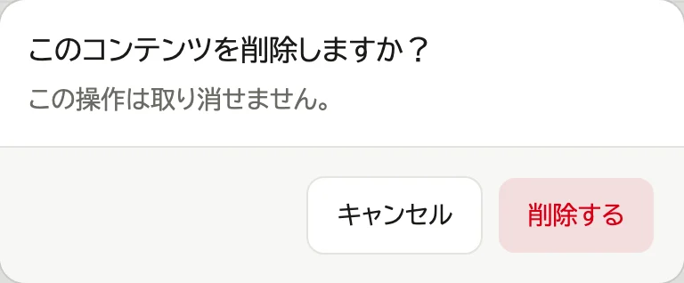

- フォルダー・アーカイブを削除しても、パソコンの中のファイルは消えません。
- グループを削除すると、中のものはグループの外 (一番上) に出ます。
