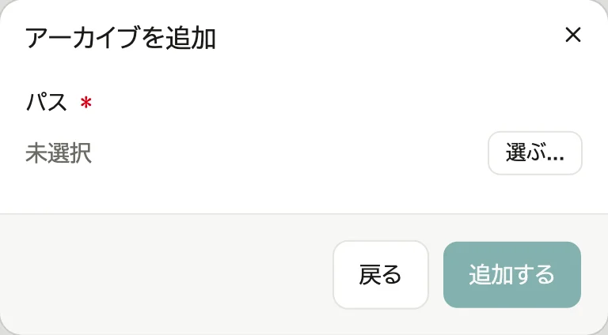
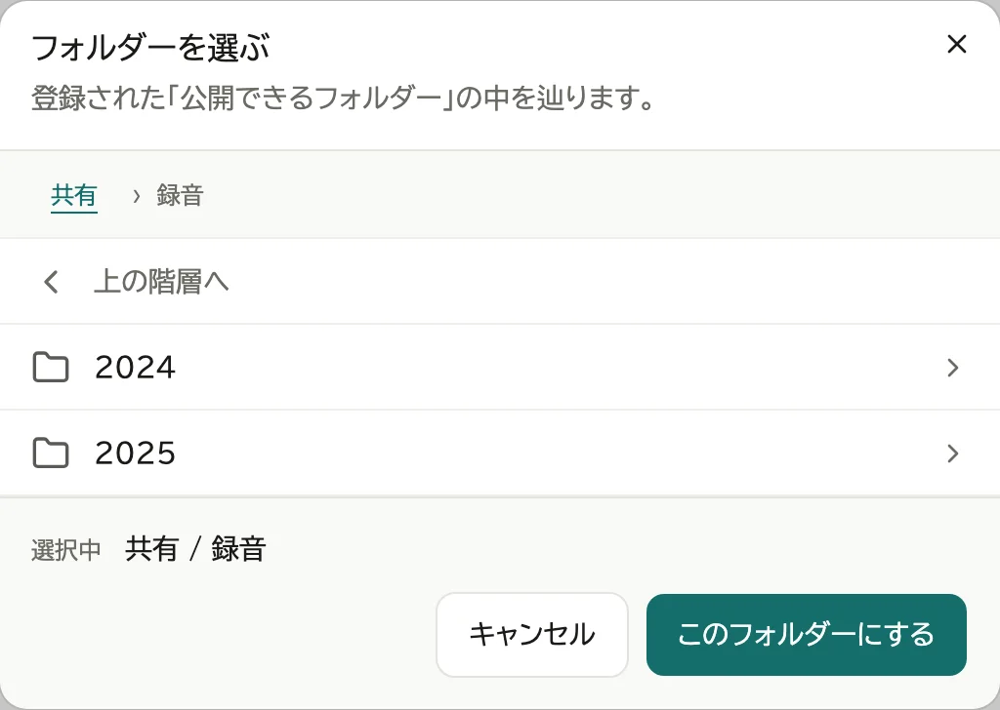
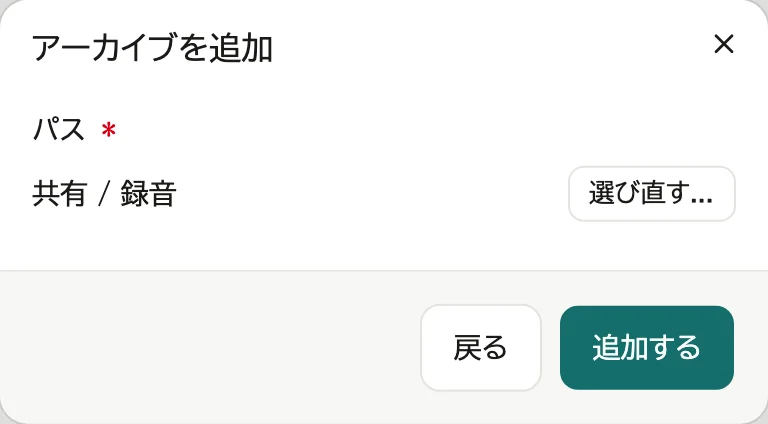
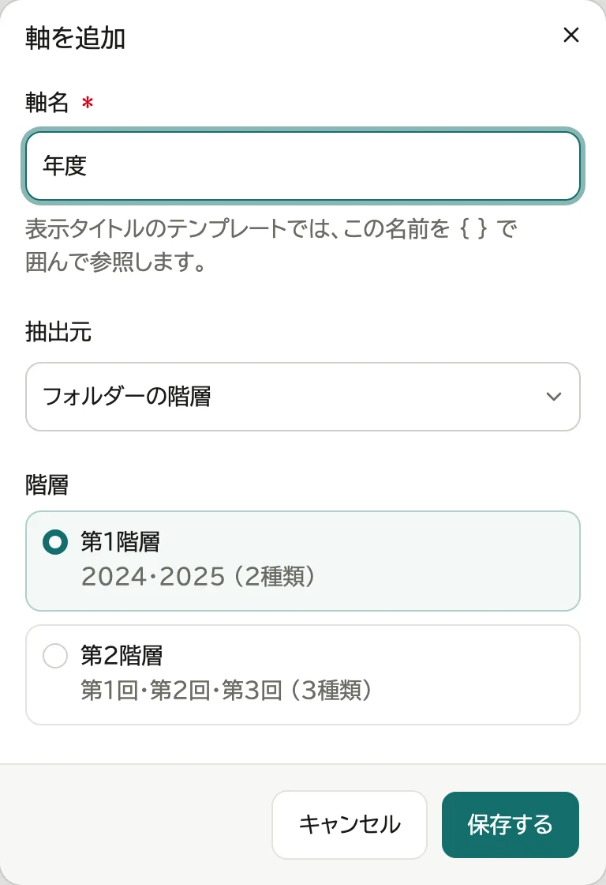
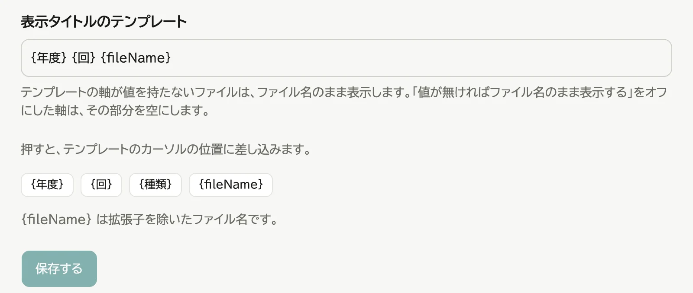
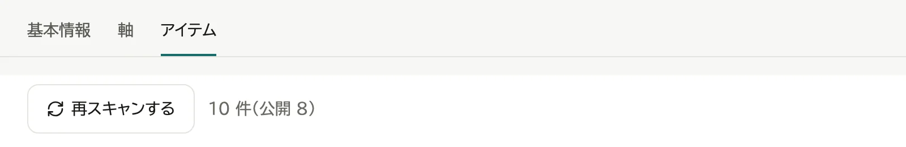
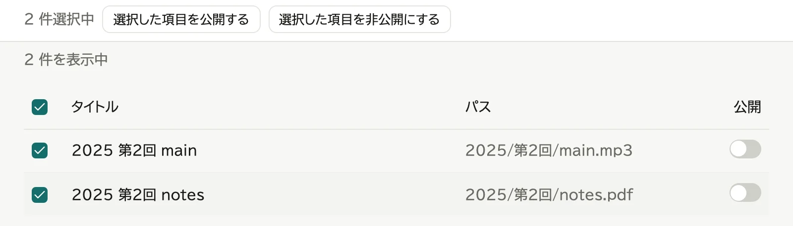
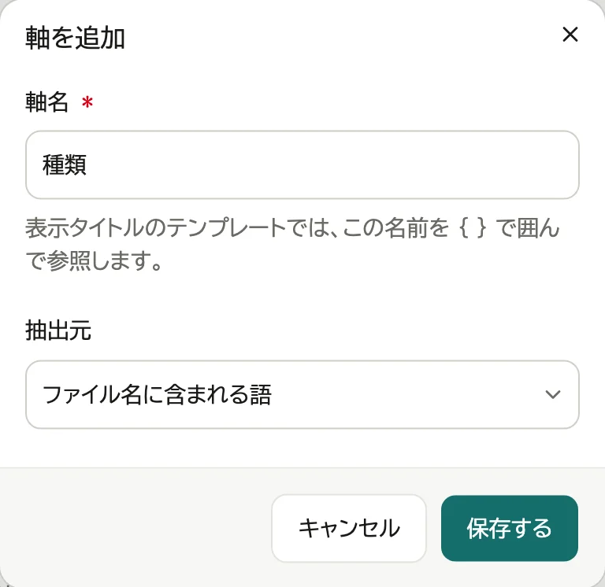
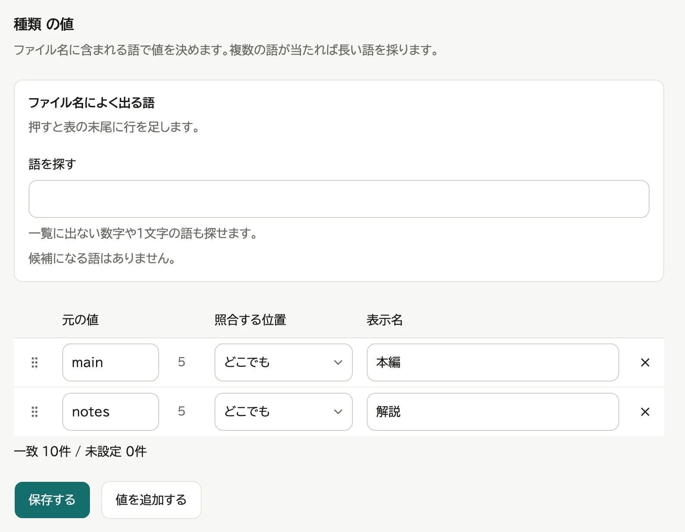
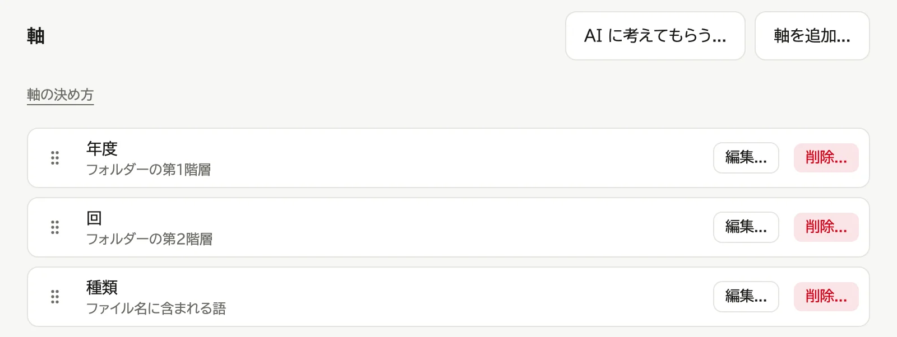

# アーカイブを設定する

アーカイブは、フォルダーの中のファイルを「年度」「回」などで絞り込めるようにします。

このページの設定は、そのアーカイブを登録した人と管理者ができます。
ほかの人が登録したアーカイブは、見ることだけができます。変更するときは、管理者に頼みます。

## 例: 年度と回で絞り込む

次のように並んだファイルの場合です。

```
録音
├─ 2024
│   ├─ 第1回
│   │   └─ main.mp3
│   └─ 第2回
└─ 2025
```

1. 「コンテンツ」の「新規追加...」で「アーカイブ」を選び、「選ぶ...」を押す

   

2. `録音` のフォルダーを開き、「このフォルダーにする」を押す

   

3. 「追加する」を押す。アーカイブの編集ページが開きます

   

4. 「軸」のタブを押し、「軸を追加...」を押す

   

5. 軸名に「年度」を入れ、抽出元は「フォルダーの階層」、階層は「第1階層」を選び、「保存する」を押す

   

6. もう一度「軸を追加...」を押し、軸名「回」、階層「第2階層」で保存する
7. 「表示タイトルのテンプレート」を `{年度} {回} {fileName}` にし、「保存する」を押す

   

8. 「アイテム」のタブを押す

   

9. 見せるファイルにチェックを付け、「選択した項目を公開する」を押す

   

**9 を忘れると、何も表示されません。**

## ファイル名の語で分ける

ファイル名に含まれる語 (例: `main`・`notes`) で分けるときです。

1. 「軸を追加...」を押し、軸名を入れ、抽出元に「ファイル名に含まれる語」を選び、「保存する」を押す

   

2. 追加した軸の行を押す
3. 「値を追加する」を押し、元の値 (`main`) と表示名 (「本編」) を入れる。語の数だけ繰り返し、「保存する」を押す

   

「照合する位置」で、語がファイル名のどこにあれば当てるかを選べます。

- どこでも (既定): ファイル名のどこかに含まれていれば当てる
- 先頭か区切りの直後: ファイル名の先頭か、英数字以外 (記号・空白・日本語など) の直後にあるときだけ当てる
- 末尾: ファイル名 (拡張子を除く) の最後にあるときだけ当てる

## AI に考えてもらう

軸の決め方に迷ったら、お使いの AI のサービス (ChatGPT・Claude など) に考えてもらえます。WebLAV が AI に送ることはなく、プロンプトと答えを自分で貼り付けます。

1. 「軸」のタブで「AI に考えてもらう...」を押す
2. プロンプトをコピーし、AI のサービスに貼り付けて送る。プロンプトにはファイルのパスが入るので、人の名前などが入っていないかを確かめてください
3. AI の答えを「AI の答えを貼り付ける」の欄に貼り付け、「確かめる」を押す
4. 軸ごとに値が決まるファイルの数と、表示タイトルの例を見て、よければ「取り込む」を押す

取り込むと、今の軸と表示タイトルは置き換わります。取り込んだ後は、ほかの軸と同じように直せます。

## 軸を直す・削除する

「軸」のタブで、軸の行の「編集...」か「削除...」を押します。



「編集...」で開く画面では、次も決められます。

- 絞り込みに出す: オフにすると、見る人の絞り込みに出さない。表示タイトルと並び順には使う
- 値が無ければファイル名のまま表示する: オフにすると、値の無いファイルはその部分を空にしてタイトルを組み立てる

抽出元か階層を変えて保存すると、その軸の値の表は消えます。

## 並び順を変える

- 絞り込みの並び: 「軸」のタブで、軸の行の頭にあるつまみをドラッグする
- 値の並び: 値の表の行の頭にあるつまみをドラッグする

## ファイルを足した・消したとき

1. アーカイブの編集ページの「アイテム」のタブで「再スキャンする」を押す

   

2. 足したファイルは非公開で入るので、チェックを付けて「選択した項目を公開する」を押す

   

公開をやめるときは、チェックを付けて「選択した項目を非公開にする」を押します。

## ファイルやフォルダーが見つからないとき

- 消したファイルや移したファイルは、見る人の一覧に出なくなります。管理画面の「アイテム」のタブには「見つかりません」と出て、再スキャンすると一覧から外れます。
- アーカイブの中でファイルを移したり名前を変えたりすると、再スキャンで新しいファイルとして入り、非公開に戻ります。もう一度公開してください。

再スキャンで次のように出たときは、アイテムの一覧も公開の設定も変わっていません。

- **「フォルダーが見つかりません。」**: アーカイブのフォルダーを消したか、移したか、名前を変えたか、外付けのドライブを外しています。
  - 移したか名前を変えたなら、「基本情報」のタブの「パス」の「選び直す...」を押して選びます。公開の設定はやり直しになります。
  - ドライブを外したなら、つないでから再スキャンします。
  - 見る人の画面にも「フォルダーが見つかりません。」と出ます。
- **「「(フォルダー)」を読めません。」「フォルダーを読めません。」**: WebLAV がそのフォルダー (後のほうはアーカイブのフォルダーそのもの) を読めません。パソコンでそのフォルダーのアクセス権を確かめ、読めるようにしてから再スキャンします。ネットワークのドライブなら、つながっているかを確かめます。
