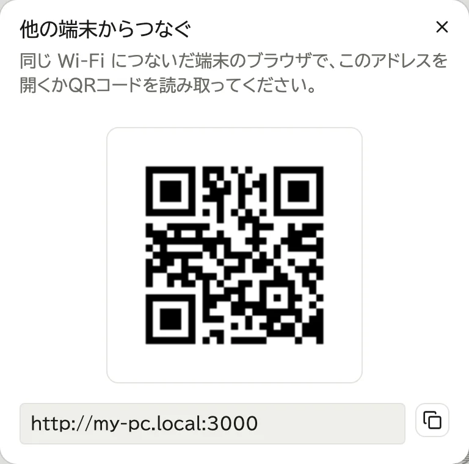
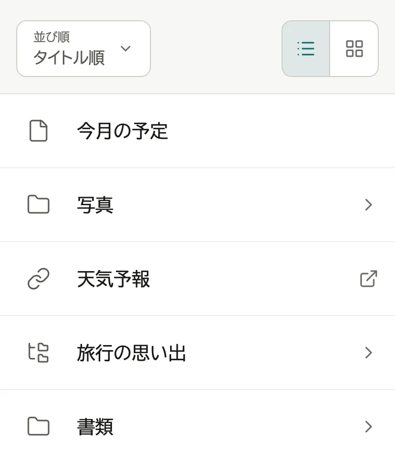
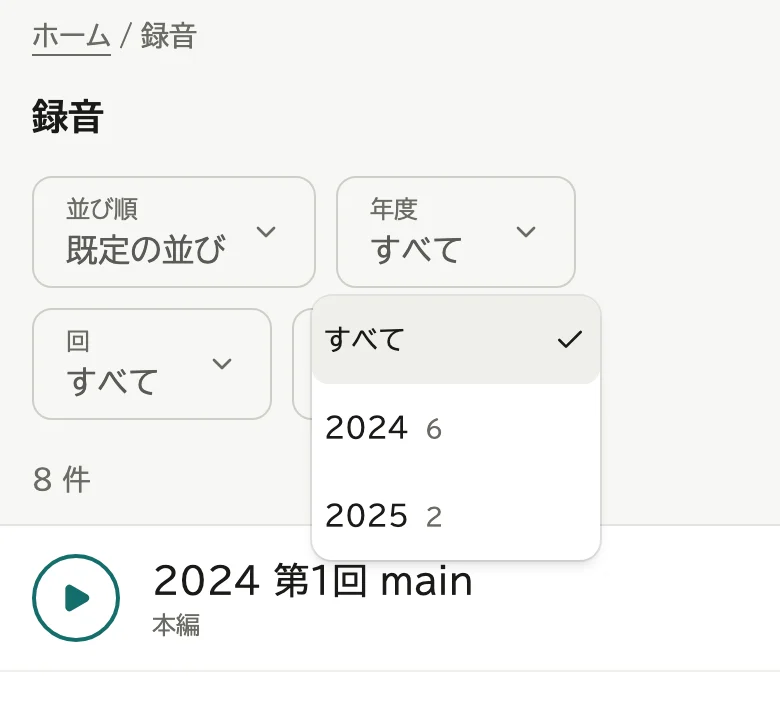
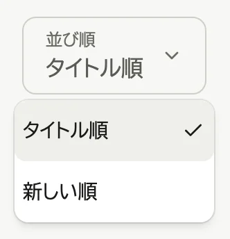
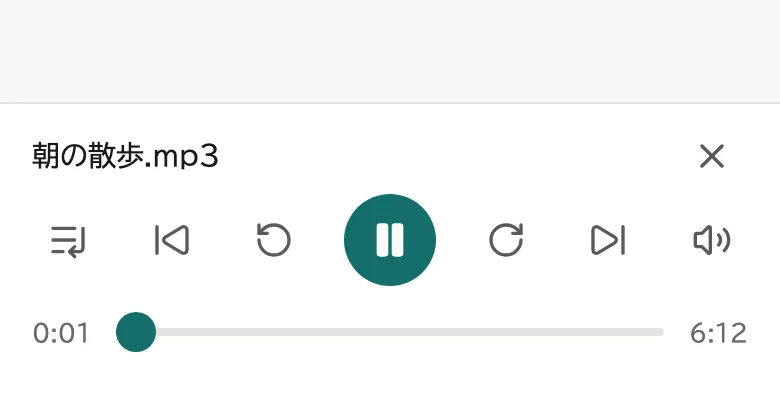
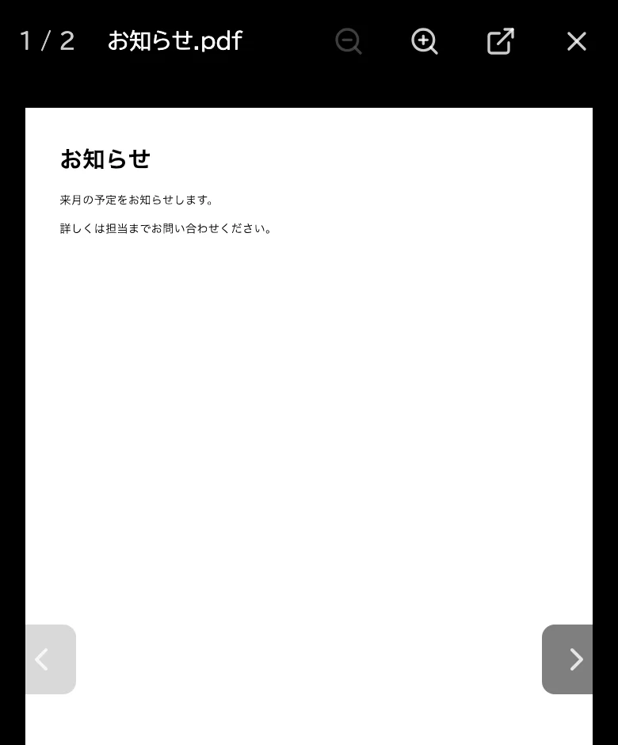

# ファイルを見る

## 開く

WebLAV を動かしているパソコンと同じ Wi-Fi につないだ端末で、教えてもらったアドレスを開くか、QR コードを読み取ります。

アドレスと QR コードは、WebLAV の画面右上の QR コードのアイコンを押すと出ます。

ログインした人にだけ見えるものもあります (→ [ログインと表示](03-account.md))。

## 探す

- 「›」の付いた行を押すと、中に入ります。

  

- 上の「ホーム」などを押すと、戻ります。
- 選択肢 (「年度」など) を押して値を選ぶと、当てはまるものだけが残ります。

  

- 「並び順」で、タイトル順と新しい順を切り替えます。アーカイブでは「既定の並び」も選べます。

  

- 「並び順」の右のボタンで、リストとタイルを切り替えます。タイルにすると、広い画面に多く並びます。選んだ形は、この端末で覚えます。

## 再生する・開く

- 音声を押すと、画面の下で鳴ります。

  

- 画像・PDF・動画・テキスト・Word・Excel・PowerPoint を押すと、その場で開きます。左右のボタンやスワイプで前後のファイルへ移れます。
- 印刷や保存は、上の矢印のボタンで新しいタブに開いてから行います。

  

- リンクを押すと、新しいタブで開きます。名前が `.links.toml` で終わるファイルを押すと、中のリンクが並びます。
