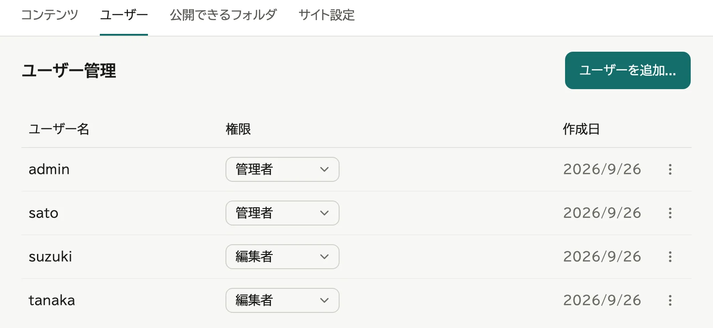
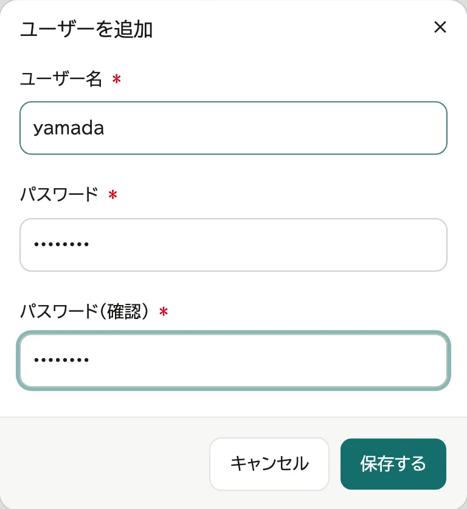
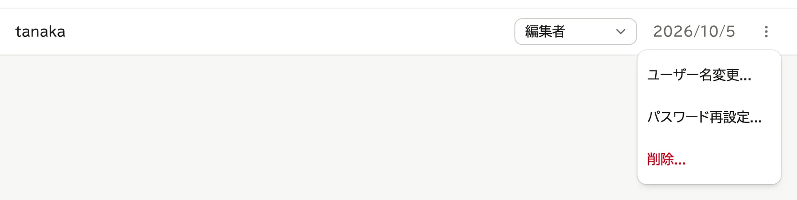
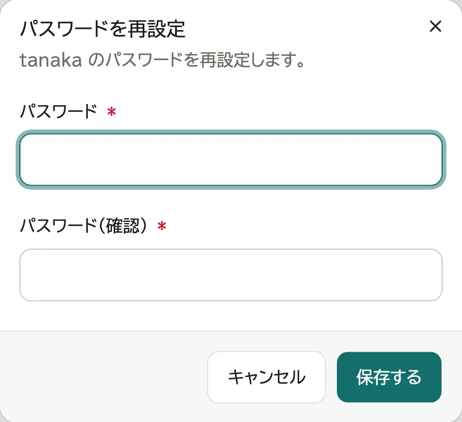
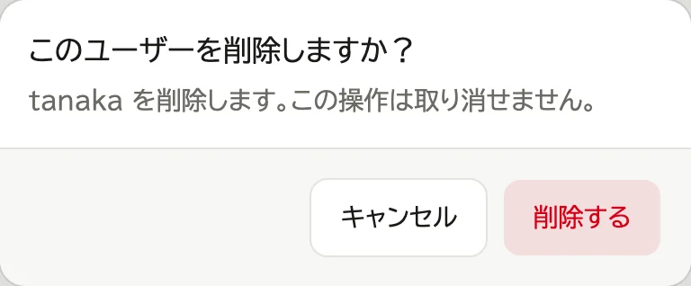

# ユーザーを管理する

## 追加する

1. 管理画面の「ユーザー」のタブで「ユーザーを追加...」を押す

   

2. ユーザー名とパスワードを決めて入れ、「保存する」を押す

   

管理者にするときは、一覧の「権限」で「管理者」を選びます。

## 権限

- **編集者**: コンテンツを登録できます。変更・削除できるのは、自分が登録したものだけです。
  ほかの人が登録したものは、管理画面で見ることだけができます。
- **管理者**: すべてのコンテンツを変更・削除できます。そのほかに、ユーザー・公開できるフォルダー・サイト設定を管理できます。

## パスワードを再設定する

パスワードを忘れた人がいたら、管理者が新しいパスワードを決めて伝えます。

1. 「ユーザー」の一覧で、行の「⋮」を押し、「パスワード再設定...」を選ぶ

   

2. 新しいパスワードを入れ、「保存する」を押す

   

再設定すると、その人のリカバリコードは使えなくなります。本人に作り直してもらいます。

リカバリコードを持っている人は、自分で再設定することもできます (→ [ログインと表示](03-account.md))。管理者が1人だけなら、その管理者のパスワードはリカバリコードでしか再設定できません。

## ユーザー名を変える

1. 「ユーザー」の一覧で、行の「⋮」を押し、「ユーザー名変更...」を選ぶ

   

2. 新しいユーザー名を入れ、「保存する」を押す

本人には、次から新しいユーザー名でログインするよう伝えます。控えたリカバリコードで戻すときも、新しいユーザー名を入れます。本人が自分で変えることもできます (→ [ログインと表示](03-account.md))。

## 削除する

1. 「ユーザー」の一覧で、行の「⋮」を押し、「削除...」を選ぶ

   

2. 「削除する」を押す

   

削除した人が登録したコンテンツは残り、管理者しか変更できなくなります。
公開範囲が「本人のみ」のものは、「非表示」に変わります。
引き継ぐ人がいれば、コンテンツの編集ページの「作成者」でその人を選び、「保存する」を押します。

管理者が1人だけのときは、その管理者を削除できません。
