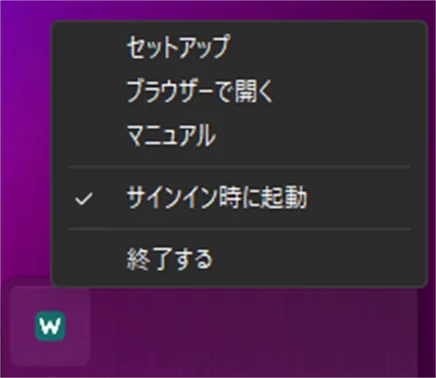
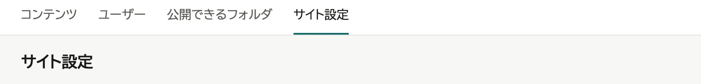
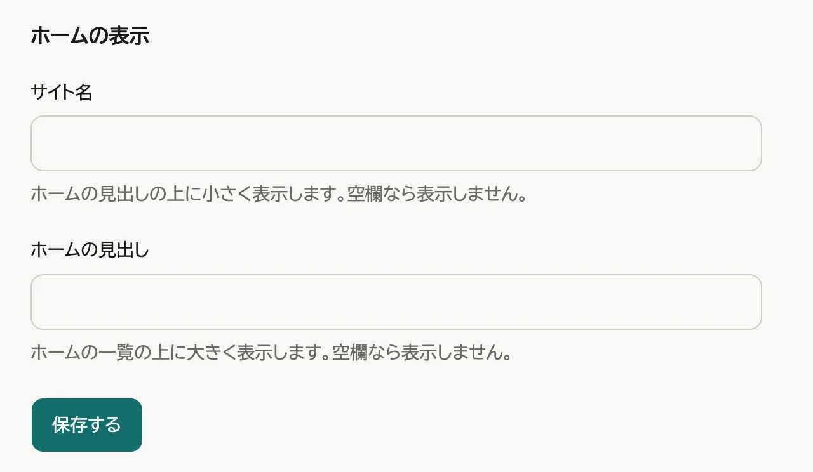
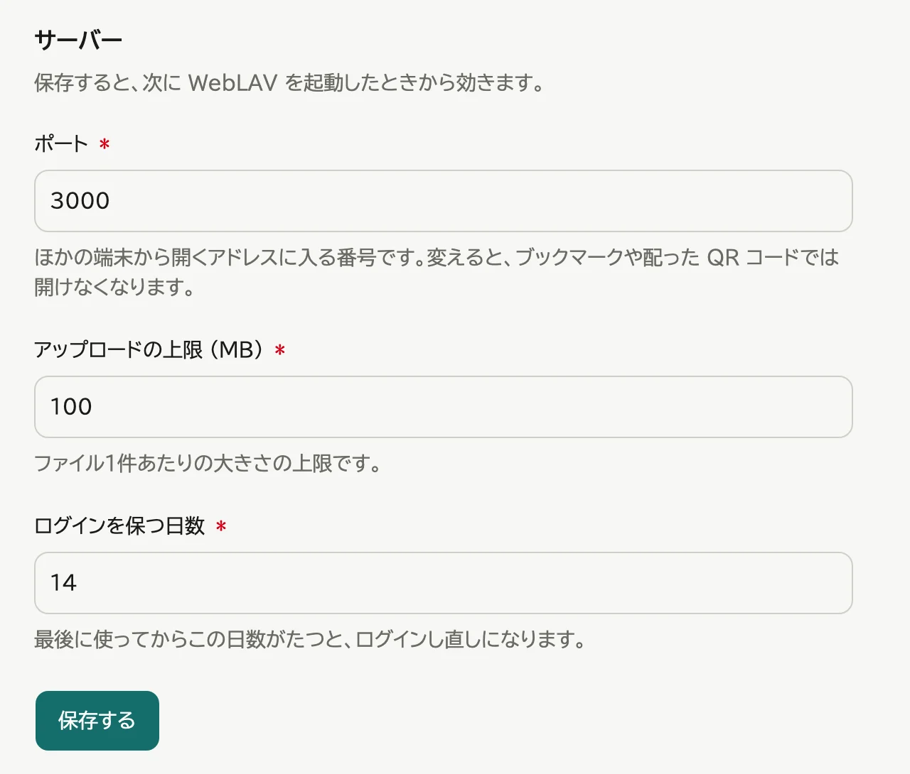
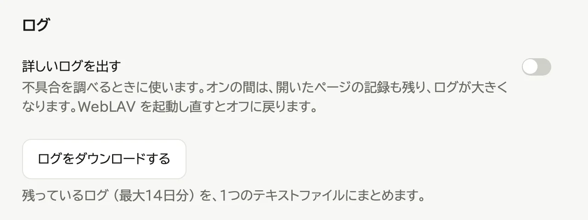
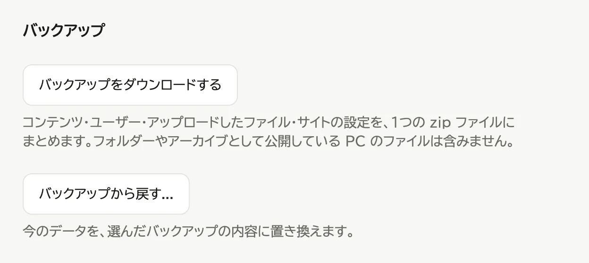

# 運用する

## 起動する・終了する

- 起動: スタートメニュー (macOS は「アプリケーション」フォルダ) から WebLAV を開く
- 終了: 通知領域 (macOS はメニューバー) の WebLAV アイコンから「終了する」を選ぶ

  

パソコンにサインインしている間だけ動きます。

## サイトの設定を変える

管理画面の「サイト設定」のタブで変えます。

- ホームの表示: サイト名とホームの見出し。空にすると出しません。

  

- サーバー: ポート、アップロードの上限、ログインを保つ日数。次に WebLAV を起動したときから効きます。

  

- ログ: 「詳しいログを出す」は不具合を調べるときに使います。WebLAV を起動し直すとオフに戻ります。
  「ログをダウンロードする」で、最大14日分のログを1つのファイルにまとめて保存できます。

  

## バックアップを取る・戻す

1. 管理画面の「サイト設定」のタブを押す

   

2. 「バックアップ」の欄で、取るときは「バックアップをダウンロードする」、戻すときは「バックアップから戻す...」を押す

   

公開しているフォルダの中のファイルは含みません。

## アップデートする

- **Windows**: Microsoft Store が自動でアップデートする
- **macOS**: WebLAV を終了し、`WebLAV.app` を新しいものに置き換える

設定とデータは引き継がれます。

## バージョンを確かめる

管理画面の「サイト設定」のタブのいちばん下、「このアプリについて」に出ます。問い合わせのときは、括弧の中の数字まで含めてお知らせください。

## アンインストールする

- **Windows**: 「設定」→「アプリ」から WebLAV をアンインストールする
- **macOS**: 「ログイン時に起動」をオフにして終了し、`WebLAV.app` をゴミ箱に入れる

公開しているフォルダの中のファイルは消えません。

**Windows では、設定とデータ (ユーザー・登録したコンテンツ・アップロードしたファイル) も消えます。** 入れ直して使い続けるなら、先に上の「バックアップを取る・戻す」でバックアップを取っておきます。

## 設定とデータの置き場所

| OS | 設定 | データ |
|---|---|---|
| Windows | `%LOCALAPPDATA%\Packages\amiiby.WebLAV_tv82n7df3ay6j\LocalCache\Roaming\amiiby\weblav\config` | `%LOCALAPPDATA%\Packages\amiiby.WebLAV_tv82n7df3ay6j\LocalCache\Local\amiiby\weblav\data` |
| macOS | `~/Library/Containers/com.amiiby.weblav/Data/Library/Application Support/com.amiiby.weblav` | 設定と同じ |

環境変数 `WEBLAV_HOME` を指定すると、その場所にまとめて置かれます。
