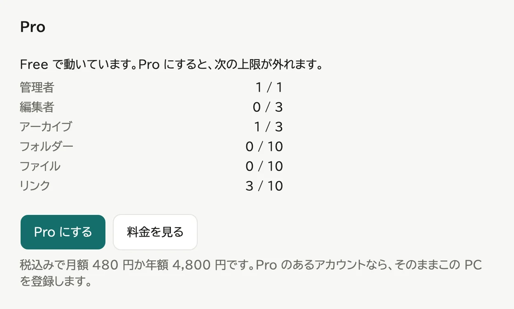
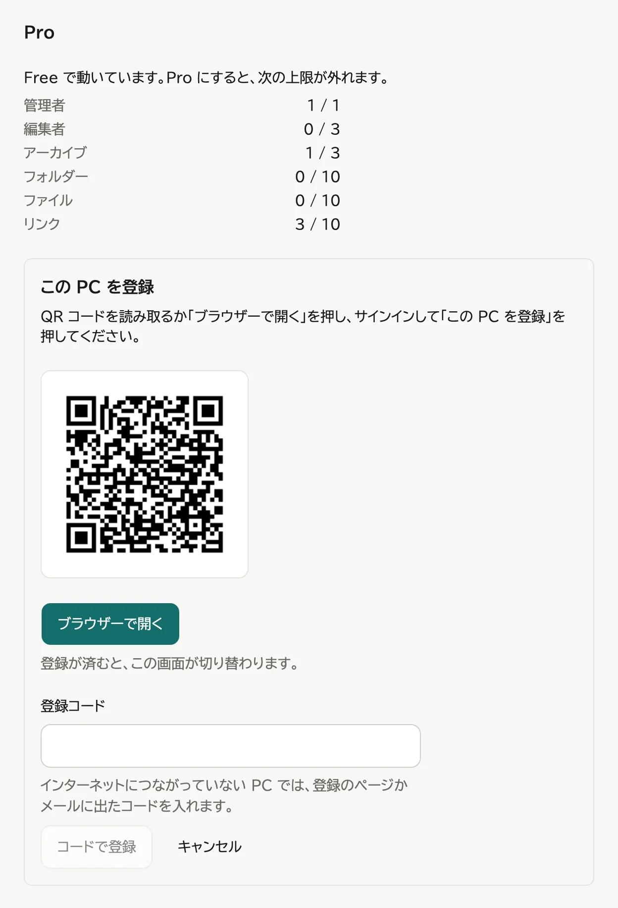

# Pro にする

WebLAV は無料の Free のままでも使えますが、登録できる数に上限があります。Pro にすると上限が外れます。

## Free の上限

| 対象 | 上限 |
|---|---|
| 管理者 | 1人 |
| 編集者 | 3人 |
| アーカイブ | 3個 |
| フォルダ・ファイル・リンク | それぞれ10個 |

Free のときは、今の数を管理画面の「サイト設定」のタブの「Pro」の欄で見られます。グループには上限がありません。

## Pro の料金

Pro (個人向け) は、月額 480 円か年額 4,800 円 (どちらも税込み) のサブスクです。期間ごとに自動で更新します。

Pro はアカウントに付き、1つのアカウントで WebLAV を3台まで Pro にできます。アカウントは、Google か、メールに届くリンクでサインインして作ります。WebLAV のユーザーとは別のものです。アカウントのページは `https://weblav.amiiby.com/account/` です。

## 申し込んで、この WebLAV を結ぶ

1. 管理画面の「サイト設定」のタブで、「Pro」の欄の「アカウントと結ぶ」を押す

   

2. 出た QR コードをスマートフォンで読み取るか、「窓口を開く」を押す

   

3. 窓口でサインインする
4. Pro をまだ持っていなければ、「同意して月額で申し込む」か「同意して年額で申し込む」を押し、支払いの画面で払う
5. 「この WebLAV を結ぶ」を押す

インターネットにつながるパソコンなら、WebLAV の画面が数秒で Pro に切り替わります。

> 「この WebLAV を結ぶ」は、自分の WebLAV の画面から開いたときだけ押してください。他の人から届いたリンクで押すと、その人の WebLAV にあなたの Pro を使わせることになります。

### インターネットにつながらないパソコン

結ぶと、窓口の画面とメールに15文字の返しのコードが出ます。WebLAV の画面の「返しのコード」に入れ、「コードで結ぶ」を押します。

コードで結んだ Pro には期限があります。期限が近づくと「Pro」の欄に知らせが出るので、「結び直す」から新しいコードを受け取ってください。期限は払い終えた期間の終わりの7日後なので、月額なら毎月、年額なら毎年この知らせが出ます。

## Pro のあいだ

インターネットにつながるパソコンは、ときどき窓口に確かめて、Pro の期限を自分で延ばします。手で操作することはありません。

窓口に送るのは、結び付きを見分ける値とサイト名、パソコンの名前だけです。パソコンの名前は、窓口のアカウントのページで、結んでいるパソコンを見分けるのに使います。送りたくない名前なら、OS の設定でパソコンの名前を変えてください。ファイルや利用者の情報は送りません。

申し込み直した後や、ほかのパソコンを外した後は、「今すぐ確かめる」を押すとすぐに反映します。

## 外す

パソコンを人に譲るときや、別のパソコンを結ぶために台数を空けるときは、そのパソコンの WebLAV の「Pro」の欄で「アカウントから外す...」を押し、「外す」を押します。

- 外すと Free に戻ります。上限を超えて今あるものは消えず、見る・直す・消すはこれまでどおりできます。足すことだけができなくなります。
- 窓口に外したことを届けられなかったときは、QR コードが出ます。スマートフォンで読み取って「枠を空ける」を押すと、台数が空きます。

パソコンが壊れて WebLAV の画面を開けないときは、アカウントのページの「結んでいる WebLAV」で「外す」を押します。そのパソコンが最後に受け取った Pro の期限まで、台数に数えたままになります。

パソコンを替えるときは、古いパソコンで外してから、新しいパソコンで結びます。バックアップには Pro の結び付きが入らないので、バックアップから戻したパソコンでも結び直します。

## 解約する

1. アカウントのページを開く。WebLAV の「Pro」の欄の「アカウントのページを開く」からも開けます
2. 「支払いを管理する (解約・支払い方法・領収書)」を押し、開いた画面で解約する

解約しても、払い終えた期間の終わりまでは Pro のまま使えます。期間が終わると、結んでいる WebLAV は7日ほどのうちに Free に戻ります。払い終えた期間は、ご都合による返金はできません。二重に請求したとき、決済の処理を誤ったとき、支払いが済んだのに Pro が付かなかったときは、その分を返金します。日本の外から申し込んだものは、購入から60日以内は Link の返金ポリシーによって返金されることがあります。

## 担当者が替わるとき

アカウントのページの「Pro を別のアカウントへ移す」で、Pro と結んでいる WebLAV をまとめて別のメールアドレスのアカウントへ移せます。パソコンを結び直す必要はありません。支払いの宛先と方法は移らないので、移し先の人がアカウントのページの「支払いを管理する (解約・支払い方法・領収書)」から直します。
