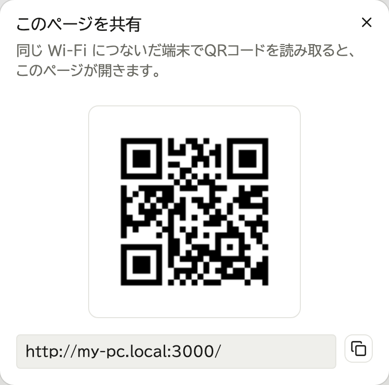
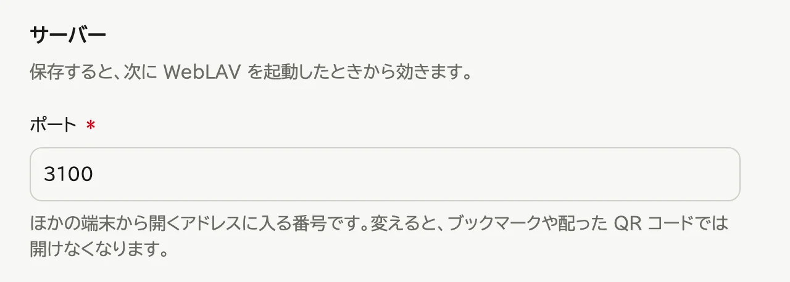

# うまくいかないとき

## 他の端末から開けない

次を順に確かめます。

1. 開く端末が、サーバーのパソコンと同じ Wi-Fi につながっているか
2. 今のアドレスで開いているか (画面右上の共有のアイコンを押し、「QRコードを表示...」を選ぶと出ます)

   

3. サーバーのパソコンの設定
   - **Windows**: 「設定」→「ネットワークとインターネット」→ 使っているネットワーク →「ネットワーク プロファイルの種類」を「プライベート ネットワーク」にする
   - **macOS**: 「システム設定」→「ネットワーク」→「ファイアウォール」→「オプション...」で WebLAV を「外部からの接続を許可」にする
   - **Ubuntu**: ファイアウォール (ufw) を有効にしているときは、ターミナルで `sudo ufw allow 3000/tcp` と打つ (そのアドレスの `:` の後ろが 3000 でなければ、その番号にする)
4. 開く端末の設定 (Safari では開けるのに Chrome などで開けないとき)
   - **iPhone・iPad**: 「設定」→「プライバシーとセキュリティ」→「ローカルネットワーク」で、ブラウザーをオンにする
   - **Mac**: 「システム設定」→「プライバシーとセキュリティ」→「ローカルネットワーク」で、ブラウザーをオンにする
   - **Android**: 「設定」→「アプリ」→ ブラウザー →「権限」→「付近のデバイス」を許可する
5. Wi-Fi をつなぎ直すか、ルーターを再起動する

## ポートの番号がずれた

メニューに「ポート 3000 を使えないため、3001 で動いています」と出ているときです。
今のアドレスで開きます。画面右上の共有のアイコンを押し、「QRコードを表示...」を選ぶと出ます。

いつもずれるときは、ポートを変えます。

1. 管理画面の「サイト設定」のタブを押す

   

2. 「ポート」を別の番号 (3100 など) にし、「保存する」を押す

   

3. WebLAV を起動し直す

## しばらくすると開けなくなる

パソコンがスリープしないように設定します。

- **Windows**: 「設定」→「システム」→「電源」
- **macOS**: 「システム設定」→「エネルギー」(ノート型は「バッテリー」)
- **Ubuntu**: 「設定」→「電源管理」で「自動サスペンド」をオフにする

## WebLAV が起動しない

データの置き場所 (→ [運用する](09-maintenance.md)) の `logs` フォルダーのログを、WebLAV を用意した人に送って相談してください。

## 管理者のパスワードを忘れた

リカバリコードで再設定します (→ [ログインと表示](03-account.md) の「パスワードを忘れたとき」)。
ほかの管理者に再設定してもらうこともできます (→ [ユーザーを管理する](08-users.md))。

リカバリコードも失くし、ほかに管理者もいないときは、WebLAV の中からは戻れません。
データを消して、[設置する](02-setup.md) の「最初の管理者を作る」からやり直します。ユーザーと登録したコンテンツもすべて消えます。

1. WebLAV を終了する
2. データの置き場所 (→ [運用する](09-maintenance.md)) の `weblav.db` を別の場所へ移す
3. WebLAV を起動し、「セットアップ」から管理者を作り直す
