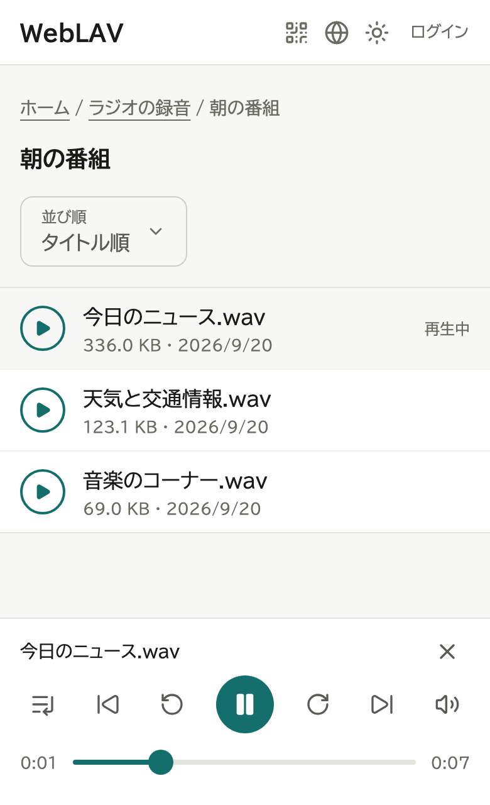
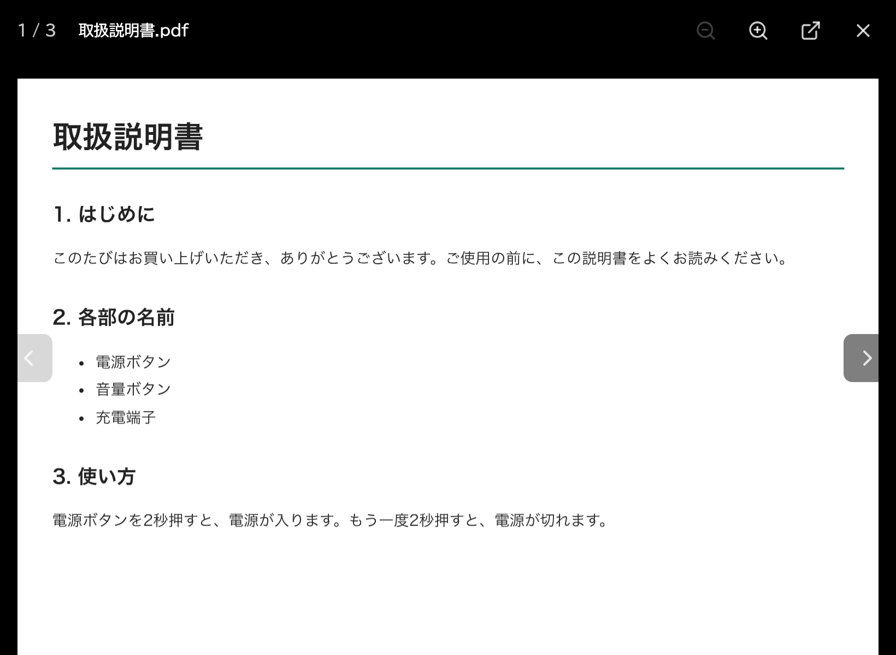
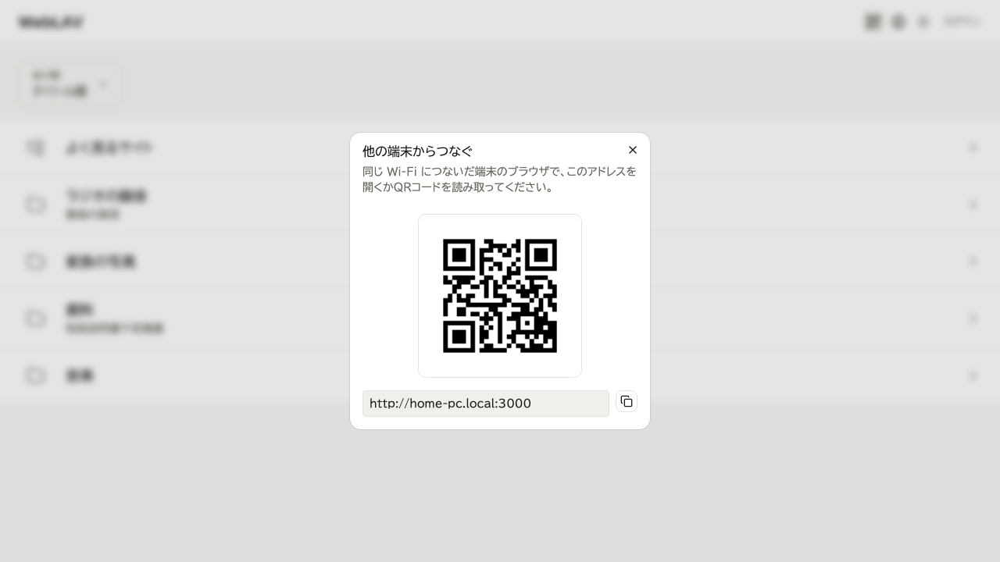
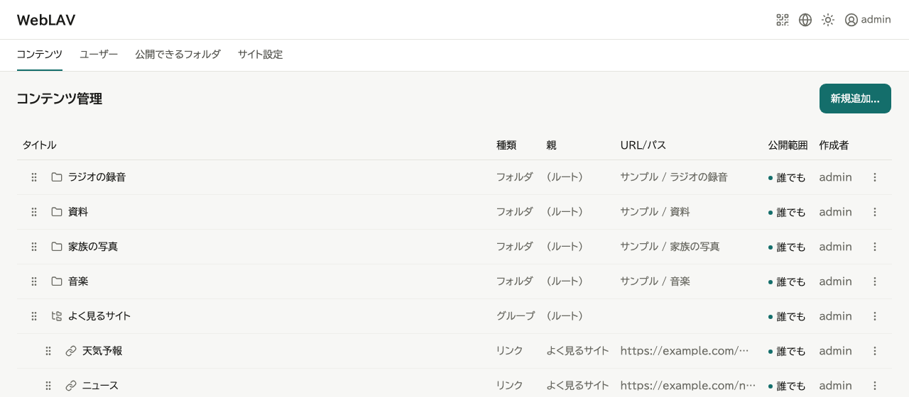

## こんなふうに使えます

- 家のパソコンにある写真や動画を、家族のスマホで見る。
- パソコンに溜めた音楽やラジオの録音を、家の中のどこでも聴く。
- 事務所の資料（PDF）を、手元のタブレットで開く。

## 主な特徴

- **置いたまま**: ファイルはパソコンに置いたまま。コピーもアップロードも要りません。
- **ブラウザだけ**: 音声・動画・PDF・画像を、ダウンロードせずにそのまま開けます。
- **QR コードで開く**: スマホのカメラで読むだけで開けます。
- **フォルダごと**: フォルダを登録しておけば、中身を入れ替えても登録し直しは要りません。
- **見せる範囲を選べる**: 誰でも、ログインした人だけ、作った本人だけ、見せない、から選べます。

## 画面

音声は、一覧から選ぶと画面の下のプレイヤーで再生できます。

PDF・動画・画像も、ページの中でそのまま開けます。

パソコンで QR コードを出して、スマホのカメラで読めば開けます。

見せるものは、パソコンのブラウザの管理画面で登録します。

## 使う流れ

1. パソコンに WebLAV を入れて、起動します。
2. タスクトレイのメニューの「セットアップ」で、管理者を作ります。
3. 管理画面で、見せたいフォルダを登録します。
4. 画面に出る QR コードを、スマホやタブレットで読んで開きます。

## よくある質問

### 無料で使えますか？

使えます。ユーザーやフォルダなどを多く登録するときは、Pro（税込み 月額 480 円・年額 4,800 円）を申し込みます。

### 外出先から見られますか？

見られません。家や事務所の、同じネットワークの中で使います。

### NAS や共有フォルダは見せられますか？

見せられません。パソコンの中のフォルダだけです。

### 通信は暗号化されますか？

されません。公共の Wi-Fi など、知らない人が入れるネットワークでは使わないでください。

### 他の端末から開けないときは？

Windows のネットワークの種類が「パブリック」だと開けません。「プライベート」に切り替えてください。

## 動作環境

- **ソフトを入れるパソコン**: Windows 10 以降（64ビット）。
- **見る側の端末**: スマホ・タブレット・パソコンの、新しいブラウザ。
